# AIT_Lab02

1. Choose a home directory, preferably your own, for which to create a backup. A full uncompressed backup should fill the ext4 partition of the backup disk to not more than 50%. If the home directory is too big, choose an appropriate sub-tree. To find out how much space is occupied by a directory tree you can use the command du -sh <directory>. The directory will be called the source directory.

**ANSWER :**

We choose to create a backup of the home directory /home/rosy since it is very small.

**SCREENSHOTS :**

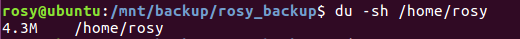

2. On the backup disk, on the ext4 partition, create a directory called <username>\_backup that will contain the backup. Change the owner of this directory from root to the owner of the source directory so that (1) you do not need superuser rights to copy files into it and (2) the user can directly read files back from the directory without needing superuser rights. The directory will be called the backup directory.

**SCREENSHOTS :**

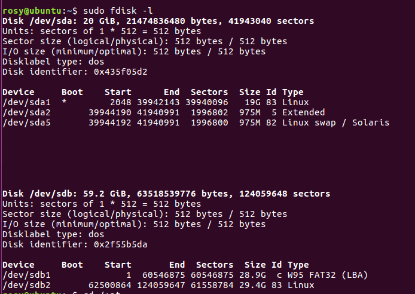

With command `sudo fdisk -l`, we see that the right partition of our backup disk to use is:
/dev/sdb2 and has space of 29.

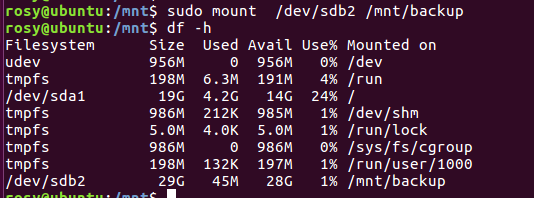

Now we will mount the disk /dev/sdb2 to the directory mnt/backup so that we can perform the commands we need.

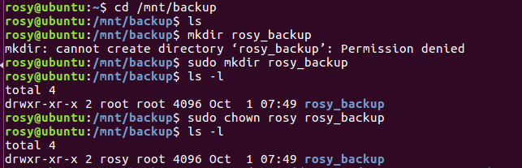

Finally, we create the rosy_backup directory and change the owner of the directory as required.

3. Perform an initial copy of the source directory to the backup directory.

**SCREENSHOTS:**

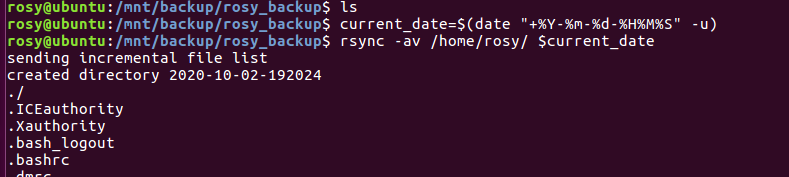

To perform the initial copy of the source directory into that directory you can use rsync with the -a and -v options:

`rsync -av <source_directory>/ 2020-09-29-093533`

+ What do these options do ?

**ANSWER :**

-v : increase verbosity
This option increases the amount of information you are given during the trans‐
fer.  By default, rsync works silently. A single -v will give  you  information
about  what  files are being transferred and a brief summary at the end. Two -v
options will give you information on what files are being skipped and  slightly
more  information  at  the end. More than two -v options should only be used if
you are debugging rsync.

-a : archive mode; equals -rlptgoD (no -H,-A,-X)

+ Specifically, which options are implied by the -a option and what do they do?

**ANSWER :**

-r :  recurse into directories
-l :  copy symlinks as symlinks
-p :  preserve permissions 
-t :  preserve modification times
-g :  preserve group
-o :  preserve owner (super-user only)
-D :  same as --devices --specials ie:
            --devices      :         preserve device files (super-user only)
            --specials     :         preserve special files

+ How can you use the date command to avoid typing the timestamp of the current time? How do you make date produce UTC time?

**ANSWER :**

`current_date=$(date "+%Y-%m-%d-%H%M%S" -u)
rsync -av /home/rosy/ $current_date`

-u flag produce UTC time.

+ How much disk space is used by the backup directory?

**ANSWER :**

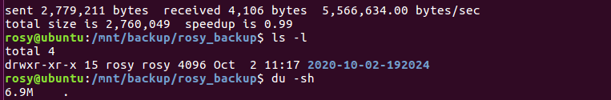

6.9M is the amount of space used by the backup directory.

4. Without having modified a file in the source directory do an incremental backup using hard links. As before the name of the destination directory is the current timestamp.

**SCREENSHOTS :**

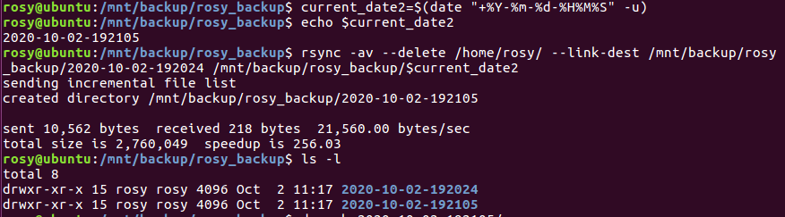

We performed the incremental backup using hard_links

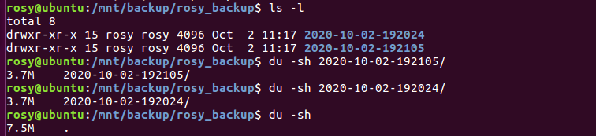

+ How much disk space is used by the backup directory according to the du command?

**ANSWER :**

The backup directory occupies 7.5M of the disk space

+ How much by the individual snapshot directories? 

**ANSWER :**

Each individual snapshot occupies 3.7M of the disk space

+ How do you explain what du displays (if you had to write the du command, how would you count hard links)?

**ANSWER :**

5. Modify a file in the source directory and perform another incremental backup like in the previous step.

**SCREENSHOTS :**

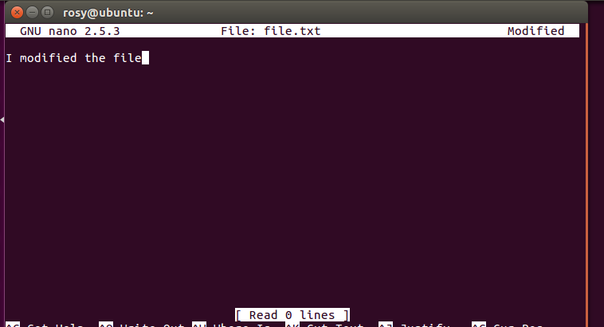

We modified one of the files named file.txt

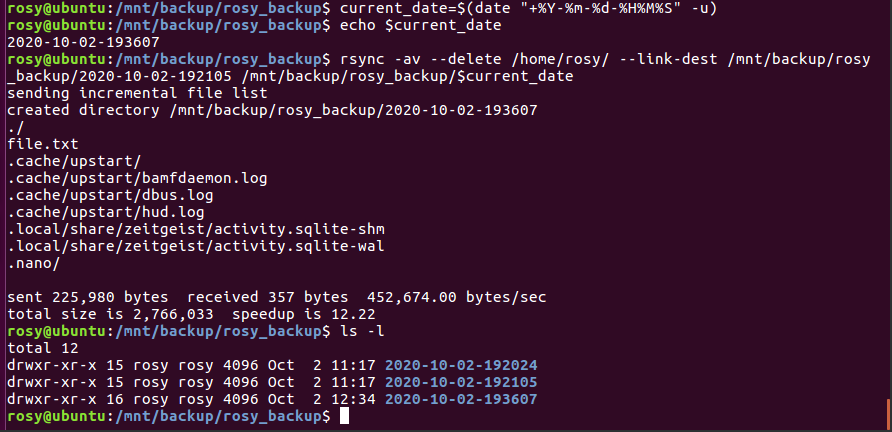

We performed an other incremental backup.

-----
Using the stat command examine the inodes of different versions of a file. Do this for a file that has not changed between backups and for a file that has changed. What do you see?

**SCREENSHOTS :**

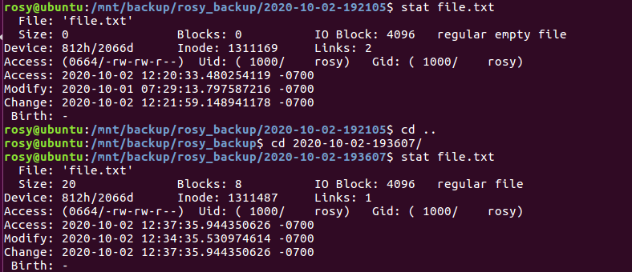

This is the screenshot of the result of stat command for a file that has changed between the most recent backup and the previous one. Here it is file.txt. When we observe the inode, we see it has changed.

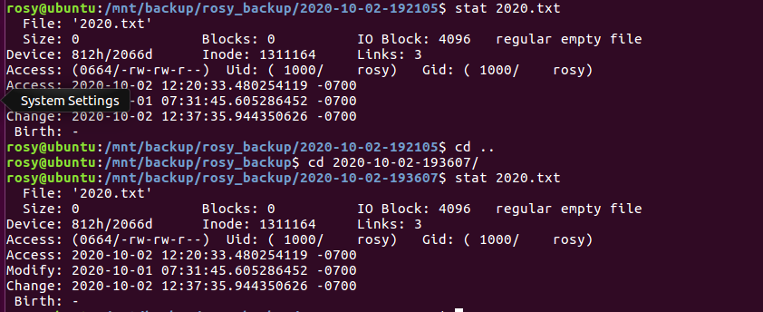

This is the screenshot of the result of stat command for a file that has not changed between the most recent backup and the previous one. When we observe the inode, we see it has not changed.

**How can we interpret it?**

6. Delete the initial full backup. What happens to the files in the incremental backup that were hardlinked to the files of the full backup?

**SCREENSHOTS :**

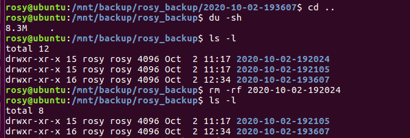

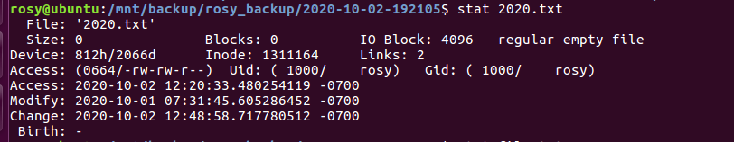

We see that the number of links for the file 2020.txt has gone down from 3 to 2 which means that the links to the full backup have been removed.